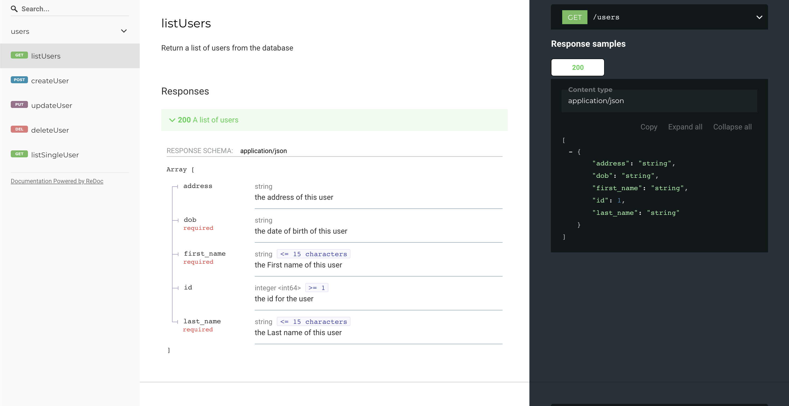

# Restful API Golang

An api which has been developed using Golang that will allow users to create, read, update and delete.

### Tools

- Golang
- JSON
- RESTful API
- Golang unit tests and Postman
- Makefile
- Swagger specifications
- Visual Studio Code
- Git w/ GitHub

### How to run

Clone the git repository and open a terminal and run below commands

```
go run main.go
```

### How to test

Open Postman and run

```
localhost:8080/users
```

OR

```
curl localhost:8080/users
```

### Swagger API docs

    http://localhost:8080/docs


